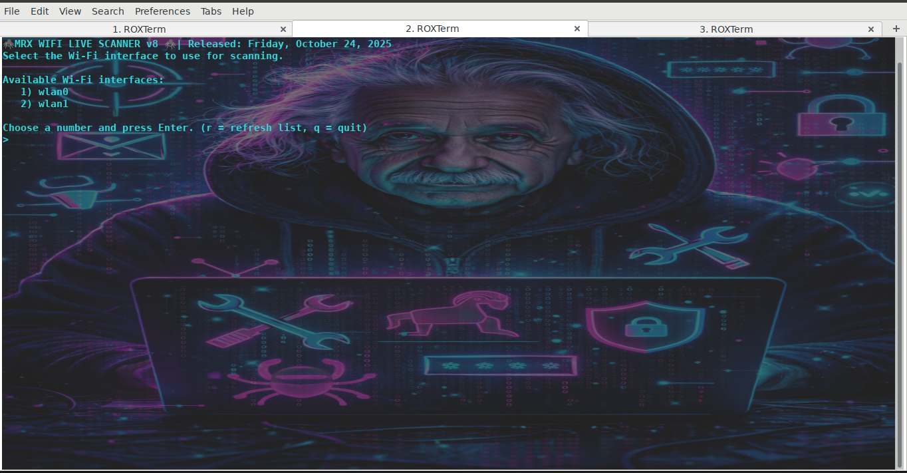
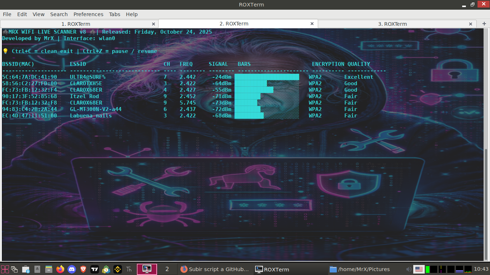

# 🕷️ MRX WIFI LIVE SCANNER v8

Live Wi-Fi scanner built in Bash for Linux systems.

---

## 🚀 Features

- 📡 Automatic Wi-Fi interface detection
- 🎯 Interactive interface selection
- 🔄 Real-time scanning (auto refresh)
- 📶 Signal strength visualization (bars)
- 🔐 Encryption detection (OPEN, WEP, WPA, WPA2)
- ⏸️ Pause / Resume (Ctrl+Z)
- ❌ Clean exit (Ctrl+C)

---

## 📸 Screenshots

### 🧭 Interface Selection


### 📡 Live Scanning


---

## 📦 Installation

```bash
git clone https://github.com/wilsontavarez/mrx-wifi-scanner.git
cd mrx-wifi-scanner
chmod +x mrx_wifi.sh
sudo cp mrx_wifi.sh /usr/local/bin/mrx_wifi
